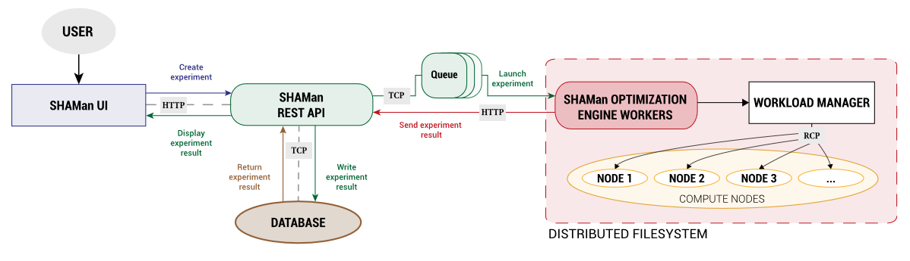

# Software's architecture

SHAMan relies on a microservice architecture and integrates:

- A front-end Web application, running with [Nuxt.js](https://github.com/nuxt/nuxt.js)
- A back-end storage database, relying on [MongoDB](www.mongodb.com/)
- An optimization engine, reached by the API through a message broker, and which uses runners to perform optimization tasks, written in Python

The several services communicate through a REST API, using [FastAPI](https://github.com/tiangolo/fastapi)

    
 
